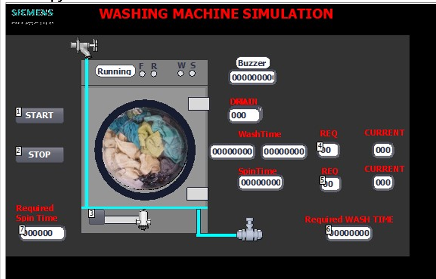
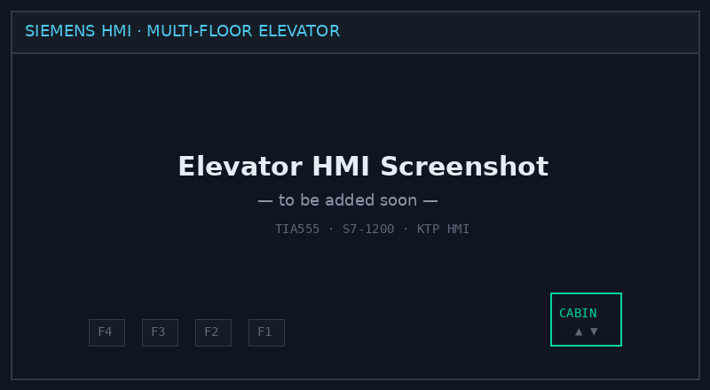

# Siemens TIA Portal Suite

> Three Siemens S7-1200 / S7-1500 projects from a single semester — washing machine cycle, multi-floor elevator, and a Festo MPS station — all programmed in TIA Portal with animated HMIs.


This repo bundles the three deliverables from **TIA555 — Totally Integrated Automation** at Seneca Polytechnic. Each project lives in its own `.zap15` archive (TIA Portal v15) and pairs ladder logic with an animated HMI built from scratch — including VB scripts for animation timing and dynamic indicators.

---

## Projects in this repo

### 1. Traffic Light + Pedestrian Crosswalk

Multi-direction intersection control on a Siemens **ET 200SP** distributed I/O block, with a touchscreen Siemens HMI showing the live state of all four approaches (north/south/east/west), pedestrian buttons, and crosswalk timing. The HMI screen — *"ASSIGNMENT 2: Integrated control system — traffic light WITH Pedestrian Crosswalk"* — graphs the intersection, animated red/yellow/green per leg, with start/stop controls.

The scenario is a worked exercise in priority handling: vehicle phases interleave with pedestrian-call phases, and a "Left Time" countdown shows the operator how long the current phase has remaining.

**Source files:** `TIA_ASSIGN.zap15`, `TIA_ASSIGN_PART_A.zap15`, `TIA_ASSIGN_PART_B.zap15`

### 2. Washing Machine Simulator


*TIA Portal HMI — animated drum (with the laundry visible during the running phase), Start/Stop, configurable Wash Time + Spin Time setpoints, status indicators (F/R/W/S), and live current values. VB scripts drive the drum animation and the running-state LEDs.*

Sequential cycle controller covering fill → wash → drain → rinse → drain → spin → done. Mode selection changes timer presets and rinse counts. The HMI shows an animated drum (rotation direction and speed reflect the active phase), water level indicator, and cycle progress.

**Source files:** `WASH11.zap15`, `Wash8.0.zap15`

### 3. Multi-Floor Elevator


*HMI screenshot — to be added.*

Direction-aware elevator simulator. Hall calls (up/down at each floor) and cabin calls are sequenced in the most efficient travel direction — no random reversal while requests remain in the current direction. The HMI animates the cabin sliding between floors driven by a single position word from the PLC, with door open/close cycles and call-light latching.

**Source file:** `ProTuto_PLC-Training-01_Elevator.zap15`

### 4. Festo MPS Station

Programs for the Seneca lab's MPS (Modular Production System) handling and sorting stations — pick-and-place + sort by attribute, with the standard Festo conveyor / actuator / sensor stack. Used as the troubleshooting target in the follow-on MEC455 course (instructor would silently disconnect a wire — the program had to fail-safe and the diagnostic had to find it).

**Source files:** `MPS_Handling_partA.zap15`, `MPS_Sorting_Final_Part_A.zap15`, `MPS_Sorting_b_fINAL.zap15`

---

## Tech Stack

| Layer | Technology |
| --- | --- |
| **Controller** | Siemens S7-1200 / S7-1500 / ET 200SP (depending on project) |
| **Programming** | TIA Portal v15 — Ladder Logic + SCL where appropriate |
| **HMI** | TIA Portal HMI (KTP series) — animated screens, alarms, recipes |
| **Scripting** | VB scripts for HMI animation timing and dynamic indicators |
| **Comms** | PROFINET (PLC ↔ HMI) |

---

## Common patterns across all three

- **Step-based sequencing.** Each cycle is implemented as numbered steps (Step 0..N) with explicit transition conditions — easier to extend, easier to fault-find than a soup of timers and bits.
- **Sensor-gated transitions.** Transitions wait on sensor confirmation, not just timers. Drain doesn't end on a timer; it ends when the level switch reads empty.
- **Animation = data, not graphics.** A single integer "position" or "phase" tag drives the entire HMI animation. The HMI does the rest. This keeps the data model thin and the PLC code testable.
- **Door/safety interlocks.** Door-open or guard-open inhibits motion across all three projects.
- **Pause/resume done correctly.** Outputs that should hold their state vs. ones that should de-energize for safety are handled distinctly. This one detail is what separates a "demo" from something defensible in front of an examiner.

---

## What I learned

- **State machines beat ad-hoc logic.** Modeling each cycle as explicit states made adding modes (washing-machine mode select) and adding floors (elevator) trivially safe.
- **HMI animation belongs as far down the stack as possible.** Drive the animation from a single piece of state and you stop fighting the HMI's layout engine. Try to drive it from many tags and you're debugging timing forever.
- **VB scripts work, but use them sparingly.** They're the right tool for animation polish but the wrong tool for sequencing. Anything sequence-related belongs in the PLC, not the HMI.
- **Troubleshooting is its own skill.** MPS practice — instructor disconnecting a random wire — taught me to read live PLC tags, audit the wiring against the program, and form/test hypotheses methodically. This is harder and more important than writing the original program.

---

## Repo contents

```
.
├── README.md
├── traffic-light/
│   ├── TIA_ASSIGN.zap
├── washing-machine/
│   ├── WASH11.zap15
│   └── Wash8.0.zap15
├── elevator/
│   └── Elevator1.0.zap15
├── mps-station/
│   ├── MPS_Handling_partA.zap15
│   ├── MPS_Sorting_Final_Part_A.zap15
│   └── MPS_Sorting_b_fINAL.zap15
├── docs/
│   ├── traffic-light-phasing.md
│   ├── washing-machine-state-diagram.md
│   ├── elevator-call-handling.md
│   └── mps-io-map.md
└── assets/
```

> 📁 **Why all four in one repo?** They're from the same toolchain (TIA Portal v15) and use the same HMI patterns. Four thin repos would dilute each other; one repo with four sections shows breadth without sacrificing depth.

---

📫 **Harpreet Singh** — [harpreetsingh.cloud](https://harpreetsingh.cloud) · [GitHub](https://github.com/harpreetsingh52004)
